# Proposed GitHub Issues — OpenOdia Hub

A curated backlog of 11 high-impact issues spanning functional features, non-functional quality (perf / a11y / SEO / security), community growth, and Odia-specific content gaps. Each issue is written maintainer-to-contributor with a problem statement, before/after, value-add, and acceptance criteria so a new contributor can self-serve.

## Index

| # | Title | Theme | Effort | Good first issue? |
|---|---|---|---|---|
| 1 | In-app "Submit a Resource" flow | Functional | M | No |
| 2 | Bookmarks & "My Hub" (anonymous, localStorage-first) | Functional | S–M | Yes (partial) |
| 3 | Compare view for models & datasets | Functional | M | No |
| 4 | Odia IME & Typing Hub | Odia content | M | No |
| 5 | Open Dataset/Model **Request Board** | Community + Functional | M | No |
| 6 | Odia Public-Domain Literature Corpus initiative | Odia content | L (epic) | No (sub-tasks: Yes) |
| 7 | Finish bilingual UI — Odia translation contributor program | Non-functional + Community | M | Yes (per-string) |
| 8 | Performance budget + Lighthouse CI on PRs | Non-functional | S–M | No |
| 9 | WCAG 2.1 AA accessibility pass | Non-functional | M | Yes (per-component) |
| 10 | Per-entity JSON-LD structured data (Dataset / SoftwareApplication / Course) | Non-functional / SEO | S | Yes |
| 11 | Test coverage uplift + Playwright smoke suite | Non-functional | M | Yes (per-page) |

Legend — **Effort**: S = < 1 day, M = 1–5 days, L = epic / multi-PR.

---

# Issue 1: In-app "Submit a Resource" flow

**Labels:** `enhancement`, `contributor-experience`, `priority: high`
**Theme:** Functional

## Problem

Today, the only way to add a tool/model/dataset to OpenOdia is to fork [Awesome-Odia-AI](https://github.com/odisha-ml/Awesome-Odia-AI), edit a README, and submit a PR. For non-developers — linguists, students, researchers — this is a hard "no". We are bleeding contributions from exactly the people who know the most Odia resources.

## Current state (before)

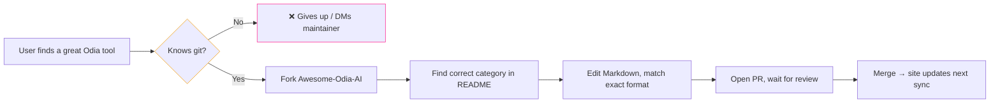

## Proposed state (after)

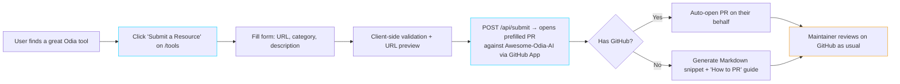

## Before vs After

| Dimension | Before | After |
|---|---|---|
| Steps for non-dev | ~7 (fork, edit, PR) | 2 (form + submit) |
| Markdown-format errors | Common | Eliminated (schema-validated) |
| GitHub account required | Yes | No (snippet fallback) |
| Time to submit | 10–30 min | < 2 min |
| Where review happens | GitHub PR | GitHub PR (unchanged) |

## Value add

- **Lowers the floor** for the people closest to Odia content (teachers, hobbyists, researchers).
- **Preserves maintainer control** — submissions still flow through Awesome-Odia-AI PR review; we just remove the data-entry friction.
- **Compounds** every other directory feature: more entries → more useful search, filters, comparisons.

## Acceptance criteria

- [ ] New route `src/routes/submit.tsx` with a typed form (Zod schema mirroring Awesome-Odia-AI categories).
- [ ] Server function `src/routes/api/submit.ts` that opens a prefilled PR against `odisha-ml/Awesome-Odia-AI` using a GitHub App installation token (no user OAuth required for v1).
- [ ] URL preview: fetch repo `og:image` + description, show inline.
- [ ] If GitHub App fails or rate-limits, fall back to a downloadable `.md` snippet + step-by-step PR instructions.
- [ ] Anti-spam: hCaptcha or Cloudflare Turnstile.
- [ ] "Submit" CTA wired into `/tools`, `/models`, `/datasets` page headers.

## Implementation notes

- The category list already lives in the Awesome-Odia-AI README — parse it server-side from `/api/awesome` so the form stays in sync.
- Reuse existing form primitives (`react-hook-form` + `zod` are already in `package.json`).
- GitHub App credentials → Cloudflare Workers secrets, not committed.

---

# Issue 2: Bookmarks & "My Hub" — anonymous personalization

**Labels:** `enhancement`, `good first issue` (sub-tasks)
**Theme:** Functional

## Problem

A visitor browsing `/models` finds three interesting models. By the time they finish reading, the URL/scroll position is lost. There's no way to say "save this for later" without copy-pasting links into a notes app. We're forcing people to leave the site to remember what they liked here.

## Current state (before)

| Action | What happens today |
|---|---|
| Like a tool | Open new tab, bookmark it externally |
| Want a curated list | Take notes by hand |
| Return next week | Search again from scratch |

## Proposed state (after)

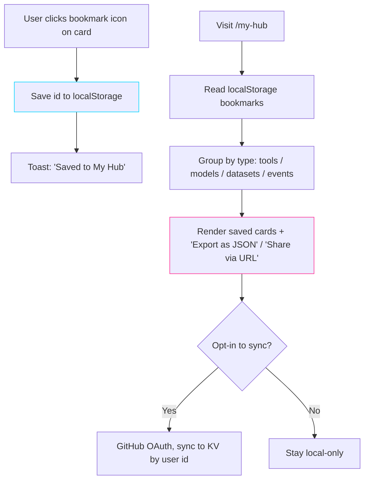

## Before vs After

| Dimension | Before | After |
|---|---|---|
| Save a tool for later | External bookmark | One click, in-app |
| Build a curated list | Manual | Auto-grouped on `/my-hub` |
| Share that list | Send 5 URLs | One shareable URL (base64 of ids) |
| Account required | — | No (localStorage); optional sync later |
| Privacy posture | n/a | Default-local, no PII |

## Value add

- **Sticky users** without the privacy/complexity cost of mandatory accounts.
- **Shareable lists** ("here are the 6 Odia STT models that work offline") become free content for the project.
- **Future-proof**: same UI hooks into auth later if we ever add it.

## Acceptance criteria

- [ ] `useBookmarks()` hook in `src/hooks/useBookmarks.ts` — read/write/toggle, namespaced by entity type.
- [ ] Bookmark button on cards in `/tools`, `/models`, `/datasets`, `/events`.
- [ ] New route `src/routes/my-hub.tsx` rendering saved items grouped by type.
- [ ] "Share" button → base64-encodes IDs into URL `?b=...`; visiting that URL hydrates the view (read-only) without touching the visitor's own bookmarks.
- [ ] Export as JSON; Import from JSON.
- [ ] Empty state with a clear "How to save things" explainer.

## Implementation notes

- IDs only — no titles/descriptions in localStorage (those re-resolve from the live API at view time, so the list stays fresh).
- Cap localStorage at ~500 items per type with a friendly warning.
- Sub-tasks (each a good first issue): icon component, hook, page, share encoder, export/import.

---

# Issue 3: Compare view for models & datasets

**Labels:** `enhancement`
**Theme:** Functional

## Problem

A researcher choosing between two Odia STT models has to open both pages on Hugging Face, eyeball metadata in different layouts, and reason in their head. The hub aggregates this data — we should let people compare it.

## Proposed flow

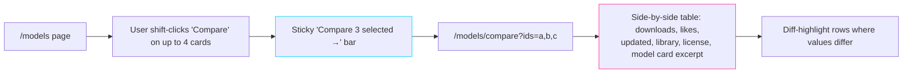

## Before vs After

| Dimension | Before | After |
|---|---|---|
| Compare 3 models | 3 tabs, mental diff | One screen, visual diff |
| Decision time | High | Low |
| Sharable comparison | No | Yes (URL has the ids) |
| Works for datasets | — | Same component, different fields |

## Value add

- Turns the hub from a *directory* into a *decision tool*.
- Drives shareable links into the wild ("here's the comparison I used") — organic SEO.
- The comparison field set will surface metadata gaps that we can then upstream to model authors.

## Acceptance criteria

- [ ] Selection state in URL search params (not localStorage) so the page is shareable.
- [ ] Routes: `/models/compare`, `/datasets/compare`.
- [ ] Max 4 entries (UI degrades gracefully on mobile to a swipeable carousel).
- [ ] Diff-highlight: each row gets a subtle background tint where values differ.
- [ ] "Add to comparison" works from the card and from the entity detail view.

---

# Issue 4: Odia IME & Typing Hub

**Labels:** `enhancement`, `odia-content`, `priority: high`
**Theme:** Odia-specific content gap

## Problem

Typing Odia on a phone or laptop is *the* first wall every Odia-language user hits. Today, OpenOdia points to tools but doesn't actually teach anyone how to type. New contributors (and even existing ones) often submit Odia text via transliteration UIs because they can't type natively. **Solve the typing problem and you unlock every other contribution.**

## Proposed page

A new route `/typing` (or `/ime`) with:

| Section | Content |
|---|---|
| **Pick your platform** | Tabbed: Android, iOS, Windows, macOS, Linux, Web |
| **Recommended IME** | Per-platform recommendation (Gboard + Odia, Lipikaar, Indic Keyboard, etc.) with install steps |
| **Try it in browser** | Embedded transliteration playground (Latin → Odia) using `openodia` package's transliterator via Pyodide |
| **Layouts cheat-sheet** | Visual keyboard with hover-to-hear pronunciation (re-using audio if available) |
| **Common pitfalls** | ଋ vs ୠ, halant rules, conjuncts — short explainers |
| **For developers** | How to add Odia input to your own app (Web Speech API, IME, font loading) |

## Architecture

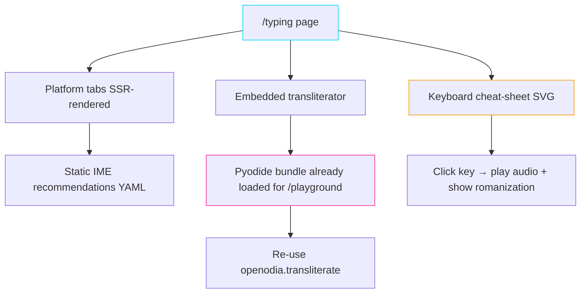

## Before vs After

| Dimension | Before | After |
|---|---|---|
| User asks "how do I type Odia?" | Search Google, mixed results | Land on `/typing`, working in 5 min |
| Try transliteration without installing | Not possible from hub | Built in |
| Developer integrating Odia input | Reverse-engineer | "For developers" section |

## Value add

- **Top-of-funnel for the entire ecosystem** — anyone who *wants* to use Odia digitally starts here.
- Reuses already-loaded Pyodide → near-zero added bundle cost.
- Surfaces `openodia` package capabilities to a non-coding audience.

## Acceptance criteria

- [ ] New route `src/routes/typing.tsx`.
- [ ] Platform tabs persist in URL hash (`#android`).
- [ ] Transliteration widget: Latin input → live Odia output via Pyodide.
- [ ] Linked from homepage hero and the global nav.
- [ ] Each IME recommendation is a separate data file under `src/data/imes/<platform>.ts` so contributors can PR additions without touching components.

---

# Issue 5: Open Dataset & Model **Request Board**

**Labels:** `enhancement`, `community`
**Theme:** Community + Functional

## Problem

A grad student needs an Odia handwritten-digit dataset. A startup needs a sentiment-labeled corpus of news headlines. There's no central place to surface these **gaps**. The Odia open-source community can't prioritize what it can't see.

## Proposed page

`/requests` — community-submitted "I wish this existed" board.

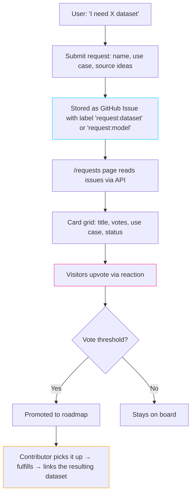

## Before vs After

| Dimension | Before | After |
|---|---|---|
| Discover unmet needs | DMs, Twitter, lost | One board, sorted by upvotes |
| Researcher proposing | No channel | Submit + get visibility |
| Decide what to build next | Maintainer's gut | Community-signaled |
| Close-the-loop | None | Fulfilled request → links the resource |

## Value add

- Turns the hub into a **two-sided market**: builders see demand, requesters get supply.
- Generates a healthy "to-do" pipeline for student projects, hackathons, and academic theses.
- Honest signal of where the ecosystem hurts.

## Acceptance criteria

- [ ] Page `src/routes/requests.tsx`.
- [ ] Reads issues with labels `request:dataset` / `request:model` / `request:tool` from this repo (or a dedicated `openodia/requests` repo).
- [ ] Submission form posts to `/api/requests` which creates the Issue via GitHub App.
- [ ] Voting = GitHub `:+1:` reaction count, rendered on the card.
- [ ] Status badges: Open / In Progress / Fulfilled (with a link to the delivered resource).
- [ ] Section on `/about` explaining how requests get prioritized.

---

# Issue 6 (epic): Odia Public-Domain Literature Corpus initiative

**Labels:** `epic`, `odia-content`, `community`, `dataset`
**Theme:** Odia-specific content gap

## Problem

Modern Odia NLP starves for clean, copyright-clear training text. Odisha has centuries of literature — Sarala Mahabharata, Jagannath Das, Madhusudan Rao, Fakir Mohan, Gangadhar Meher — much of it out of copyright. **No one is digitizing it as a clean, license-clear corpus.**

This is a multi-quarter epic, not a single PR. The point of the issue is to make the initiative visible, recruit collaborators, and break it into sub-issues.

## Proposed structure

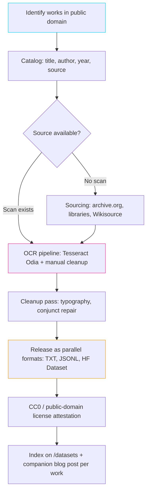

## Workstreams (each becomes a sub-issue, several are good first issues)

| # | Workstream | Owner type | Effort |
|---|---|---|---|
| 6.1 | Compile copyright-cleared bibliography (≥ 30 works) | Researcher | S |
| 6.2 | Decide on canonical format (JSONL schema with metadata) | Maintainer | S |
| 6.3 | OCR benchmark: Tesseract vs Google Vision vs IndicOCR for Odia | Engineer | M |
| 6.4 | Volunteer proofreading workflow (Wikisource-style page-pair UI) | Engineer | L |
| 6.5 | First work end-to-end (proof of concept: ~10k lines) | Mixed | M |
| 6.6 | HuggingFace dataset publication + dataset card | Engineer | S |
| 6.7 | Per-work blog post + author bio | Writer | S each |

## Before vs After

| Dimension | Before | After |
|---|---|---|
| Public-domain Odia training text | Scattered, ad-hoc | Catalogued, versioned, licensed |
| Researcher access | "Email someone" | `datasets.load_dataset('openodia/...')` |
| Visibility for the literature itself | Minimal | One blog post per work |

## Value add

- **Closes the single biggest data gap** for Odia LLMs, TTS training, and OCR.
- **Cultural preservation** as a side effect of building ML infrastructure.
- Makes OpenOdia the *source* of canonical data, not just a directory of it.

## Acceptance criteria (for opening the epic)

- [ ] This issue exists with sub-tasks 6.1–6.7 broken out.
- [ ] A "Literature Corpus" callout section on `/datasets` linking to the epic.
- [ ] A `/literature` landing page describing the initiative and how to help.

---

# Issue 7: Finish bilingual UI — Odia translation contributor program

**Labels:** `enhancement`, `i18n`, `community`, `good first issue` (per-string)
**Theme:** Non-functional + Community

## Problem

`src/locales/or.ts` is 17 lines and contains **zero translated strings** — only a TODO note saying "bring in a native Odia speaker". The infrastructure is in place; the *translations* are not. Shipping "Odia-language UI" as a half-finished feature undermines the project's whole pitch.

## Current state (before)

```ts
// src/locales/or.ts (today)
export const or: Partial<Record<keyof typeof en, string>> = {
  // Filled — required as the toggle's own label.
  // (No keys yet for translated strings; add entries here as they're verified.)
};
```

→ Toggling to Odia today shows English everywhere.

## Proposed system (after)

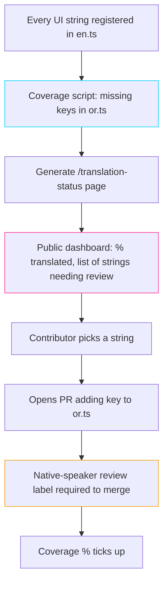

## Before vs After

| Dimension | Before | After |
|---|---|---|
| Odia coverage | ~0% | Tracked publicly, target 100% |
| Contribution path | None | One string per PR — good first issue |
| Review quality | n/a | "native-speaker-reviewed" label gate |
| Visibility of progress | n/a | `/translation-status` dashboard |

## Value add

- **Authenticity**: a bilingual hub for an Odia project should *actually* render Odia.
- **Onboarding magnet**: "translate one string" is the lowest-friction first PR in open source.
- Forces us to identify strings that don't translate well (idioms, brand names) and adjust the English source.

## Acceptance criteria

- [ ] `scripts/check-locale-coverage.ts` — fails CI if a new English key is added without at least a placeholder + tracking entry.
- [ ] `src/routes/translation-status.tsx` — renders % coverage, list of untranslated keys with quick links to edit on GitHub.
- [ ] `CONTRIBUTING.md` gains a "Translate one string" path.
- [ ] PR template auto-adds the `needs-native-speaker-review` label on PRs that touch `or.ts`.
- [ ] First batch: 30 highest-traffic strings (nav, hero, common buttons) translated and reviewed.

---

# Issue 8: Performance budget + Lighthouse CI on every PR

**Labels:** `enhancement`, `non-functional`, `performance`
**Theme:** Non-functional

## Problem

The site already loads heavy assets: framer-motion animations, Pyodide WASM on `/playground` (~10 MB), Prism for syntax highlighting, multiple Radix primitives. Without a budget, every PR risks shaving 100 ms off "feels snappy" until one day it's 2 s.

## Proposed pipeline

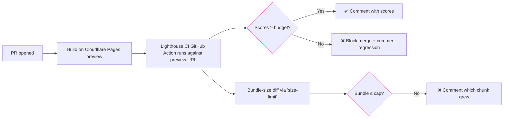

## Proposed budgets (initial — tune from current baseline)

| Metric | Budget | Notes |
|---|---|---|
| LCP (mobile) | < 2.5 s | Hero must paint fast |
| TBT | < 200 ms | Animations should yield |
| CLS | < 0.05 | Already strict |
| Initial JS (gzipped, home route) | < 200 KB | Excludes Pyodide route |
| Pyodide route initial JS | < 250 KB | Pyodide loads after click, not on nav |
| Lighthouse Accessibility | ≥ 95 | Coordinate with Issue 9 |
| Lighthouse SEO | ≥ 95 | Coordinate with Issue 10 |

## Before vs After

| Dimension | Before | After |
|---|---|---|
| Regression detection | After deploy, by feel | Pre-merge, by CI |
| Bundle growth | Invisible until "the site feels slow" | PR comment shows the new KBs |
| Pyodide load | Eager on `/playground` | Lazy on user click (sub-task) |
| Decision support for "should we add this lib?" | Vibes | Numbers |

## Value add

- **Protects** the work already done.
- Forces conversations about heavy deps *before* they ship.
- The Pyodide lazy-load alone is a measurable LCP win for the `/playground` route.

## Acceptance criteria

- [ ] `.github/workflows/lighthouse.yml` runs against the Cloudflare Pages preview deployment.
- [ ] Baseline scores captured and committed to `lighthouserc.json`.
- [ ] `size-limit` configured with per-route caps; CI comment on every PR.
- [ ] Pyodide loads on user gesture, not on route mount (separate PR, referenced).
- [ ] README badge for Lighthouse scores.

---

# Issue 9: WCAG 2.1 AA accessibility pass

**Labels:** `enhancement`, `non-functional`, `accessibility`, `good first issue` (per-component)
**Theme:** Non-functional

## Problem

The site is motion-heavy: framer-motion entrances, smooth scroll via Lenis, hover effects everywhere, the magnetic button. Beautiful — and a real problem for users with vestibular disorders, screen readers, or keyboard-only navigation. For a project aiming to serve all Odia speakers, including those with disabilities, this is non-negotiable.

## Audit dimensions

| Dimension | What we check | Likely current state |
|---|---|---|
| `prefers-reduced-motion` | Every Reveal / motion.div respects it | ⚠️ Partial |
| Keyboard navigation | All cards/CTAs reachable by Tab, focus visible | ⚠️ Unverified |
| Screen reader | Card labels, filter chips, dialog roles | ⚠️ Unverified |
| Color contrast | Neon `#00d4ff` on dark, magenta on dark | ⚠️ Borderline |
| Form labels | Search, filters | ⚠️ Probably OK |
| Skip-to-content link | Bypass nav | ❌ Missing |
| Language attribute | `lang="or"` when switching to Odia | ❌ Likely static |

## Proposed flow

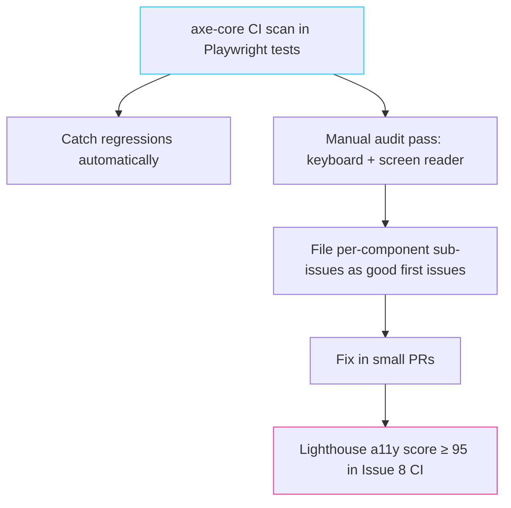

## Before vs After

| Dimension | Before | After |
|---|---|---|
| Reduced-motion users | Site looks "broken" / nauseating | Static fallbacks for every animation |
| Keyboard users | Some traps likely | Full tab order documented + tested |
| Screen-reader users | Best-effort | Labelled landmarks + live-region announcements for "Load more" |
| Compliance posture | Unknown | WCAG 2.1 AA documented |

## Value add

- **Inclusivity** as a first-class principle, not an afterthought.
- Many Odia communities include older speakers and users on low-end devices/connections — a11y improvements help them too.
- Side benefit: keyboard tests catch UX bugs sighted-mouse users never notice.

## Acceptance criteria

- [ ] `prefers-reduced-motion` honored in `Reveal`, all `motion.*` components, `Lenis`, `Marquee`, and the magnetic button.
- [ ] Skip-to-content link on `__root.tsx`.
- [ ] `<html lang>` updates when the language toggle changes.
- [ ] Focus styles visible on all interactive elements (not just default browser ring).
- [ ] All Radix dialogs/popovers have correct labels.
- [ ] axe-core assertion integrated into Playwright smoke tests (Issue 11).

---

# Issue 10: Per-entity JSON-LD structured data

**Labels:** `enhancement`, `non-functional`, `seo`, `good first issue`
**Theme:** Non-functional / SEO

## Problem

`itemListSchema` JSON-LD was added for list pages (closed Issue #4), but **per-entity** structured data is missing. A model card on the hub today says nothing to Google about being a dataset or software project. We're leaving discoverability on the table.

## Proposed schemas

| Entity | Schema.org type | Fields to map |
|---|---|---|
| Tool / repo | `SoftwareApplication` | name, url, description, programmingLanguage, license, codeRepository |
| Model | `SoftwareSourceCode` + `Dataset`-like metadata | name, url, license, programmingLanguage, dateModified, contentSize |
| Dataset | `Dataset` | name, description, license, distribution, creator, keywords |
| Tutorial (video) | `VideoObject` | name, description, thumbnailUrl, uploadDate, contentUrl, duration |
| Event | `Event` | name, startDate, endDate, location, eventStatus, organizer |
| Blog post | `BlogPosting` | headline, author, datePublished, dateModified |

## Before vs After

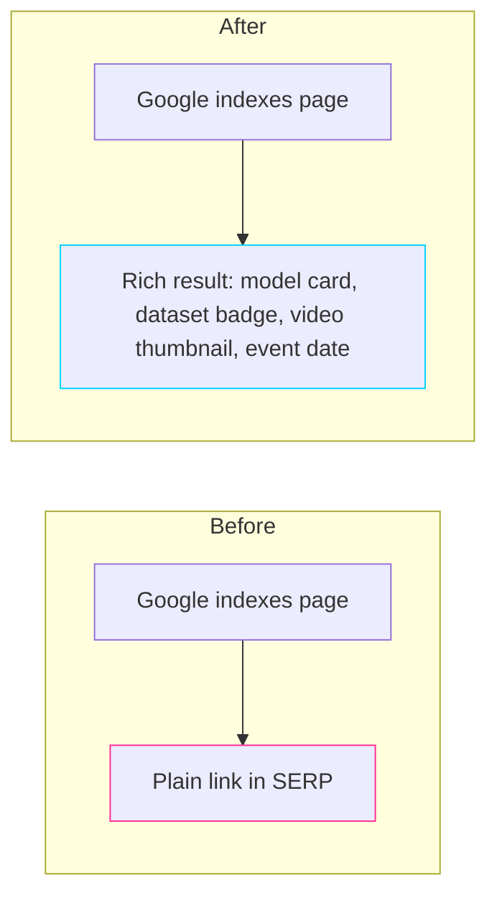

| Dimension | Before | After |
|---|---|---|
| SERP appearance | Plain blue link | Rich card with metadata |
| Discoverability via Google Dataset Search | No | Yes |
| Discoverability via video carousels | No | Yes (with `VideoObject`) |
| Maintenance | n/a | Centralized helper |

## Value add

- Many researchers find datasets via **Google Dataset Search** — being indexable there is high-leverage.
- Video schema makes the tutorial library appear in Google video carousels.
- One small PR per entity type → ideal good-first-issue ladder.

## Acceptance criteria

- [ ] Helper `src/lib/jsonld.ts` with one builder per schema type.
- [ ] Each entity detail/section renders its schema inline as `<script type="application/ld+json">`.
- [ ] Schema validated against `schema.org` types in unit tests (or with the Rich Results Test in a docs snippet).
- [ ] Documentation in `CONTRIBUTING.md`: "When adding a new entity type, add a schema builder."

---

# Issue 11: Test coverage uplift + Playwright smoke suite

**Labels:** `enhancement`, `non-functional`, `testing`, `good first issue` (per-page)
**Theme:** Non-functional

## Problem

`test/` exists but coverage is thin. The site relies on many external APIs (Hugging Face, GitHub, PyPI, YouTube) that can rate-limit, change shape, or go down — we have no automated way to know we've shipped a broken render until a user reports it. Playwright is already in `package.json` (used by Pyodide). We're not using it for the obvious thing.

## Proposed test pyramid

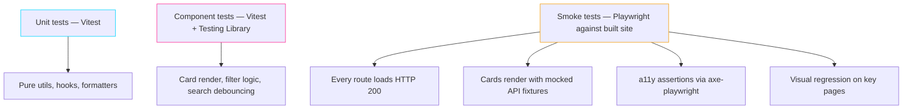

## Coverage targets

| Layer | Today (est.) | Target |
|---|---|---|
| Unit | Low | 80% on `src/lib/` |
| Component | Low | Every page-level component has a "renders without crashing" + one interaction test |
| Smoke | None | All routes return 200; key flows green |
| a11y assertions | None | axe-core passes on every smoke-tested route |

## Before vs After

| Dimension | Before | After |
|---|---|---|
| Confidence to refactor | Low | High |
| Catch HF/GitHub API shape changes | After user complaint | In CI with recorded fixtures |
| Contributor PR feedback | Manual review only | Tests confirm core flows |
| a11y enforcement | None | Built into smoke tests |

## Value add

- **Reduces maintainer load** — most regressions catch themselves.
- **Recorded fixtures** for the external APIs double as documentation of the expected schemas.
- Good-first-issue ladder: one route, one smoke test per PR.

## Acceptance criteria

- [ ] `test/e2e/` directory with one Playwright spec per route.
- [ ] `msw` (Mock Service Worker) or recorded HAR files for stable API fixtures.
- [ ] CI job `e2e` runs Playwright against `bun run preview`.
- [ ] axe-playwright assertion in every smoke test.
- [ ] Coverage report posted as a sticky PR comment.
- [ ] Visual regression (Percy or Playwright's built-in screenshot diff) on `/`, `/tools`, `/models`, `/datasets`, `/events`, `/playground`.

---

# Roll-up: where each issue moves the needle

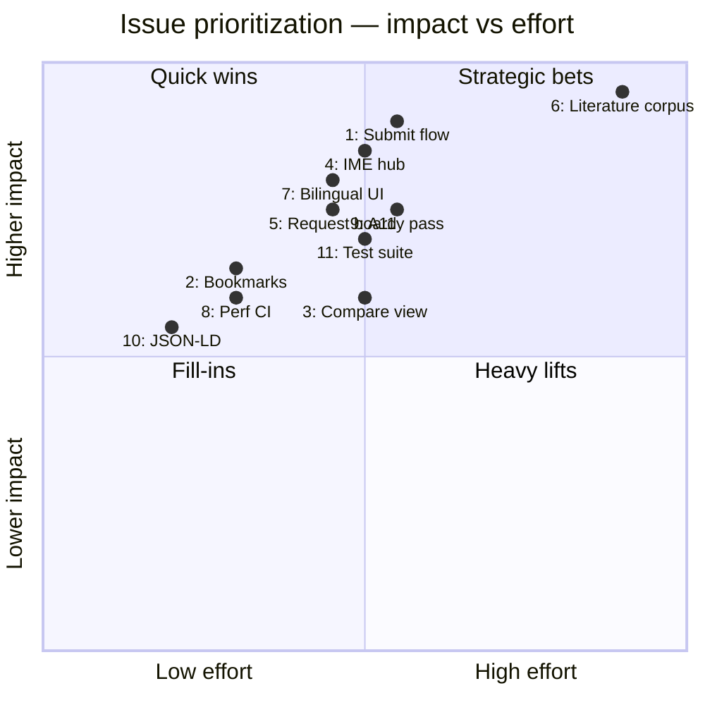

## Suggested sequencing

1. **Now (foundations):** #8 Perf CI, #10 JSON-LD, #11 Test suite — guardrails before adding surface area.
2. **Next quarter (growth):** #1 Submit flow, #2 Bookmarks, #5 Request board — lower friction, build the loop.
3. **Anchor (Odia identity):** #4 IME hub, #7 Bilingual UI — what makes OpenOdia *Odia*.
4. **Long arc (legacy):** #6 Literature corpus — the multi-year cultural play.
5. **As capacity allows:** #3 Compare view, #9 A11y pass (#9 should overlap with #8/#11 since they share CI surface).

---

## How to use this file

- This is a proposal, not a commitment. Edit / drop / re-order before posting.
- To turn any block into a real GitHub issue: copy from the `# Issue N:` heading down to the next `---`, paste into `gh issue create --title "..." --body-file -`.
- Labels referenced (`enhancement`, `good first issue`, `documentation`) already exist on the repo; new ones (`odia-content`, `non-functional`, `community`, `accessibility`, `performance`, `seo`, `testing`, `i18n`, `epic`, `priority: high`) will need to be created the first time they're used.
