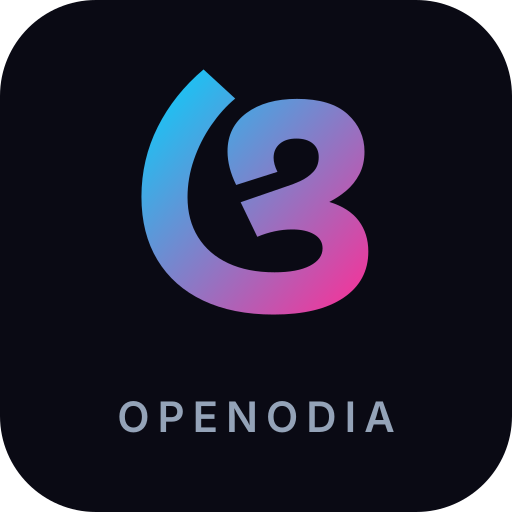

<p align="center">
  
</p>

<h1 align="center">OpenOdia Hub</h1>

<p align="center">
  
  
  
  
  
  
</p>

<p align="center">
  <strong>Open source for the Odia language</strong> — a growing constellation of tools, libraries,<br>
  and resources making Odia a first-class citizen in modern AI and software.
</p>

<p align="center">
  <a href="https://openodia.com">openodia.com</a>
</p>

---

## What is OpenOdia?

OpenOdia is the hub for Odia language open-source. Built and maintained by [Soumendra Kumar Sahoo](https://github.com/soumendrak), it spans three pillars:

- **[@openodia on YouTube](https://www.youtube.com/@openodia)** — tutorials, talks, and demos in Odia & English
- **[OpenOdia · PyPI](https://pypi.org/project/openodia/)** — a Python package of practical tools for Odia language processing
- **[Awesome-Odia-AI](https://github.com/odisha-ml/Awesome-Odia-AI)** — a curated, live directory of 60+ Odia datasets, models, and tools

This repository is the web frontend that brings everything together.

## Tech Stack

| Layer       | Technology                                            |
| ----------- | ----------------------------------------------------- |
| Framework   | [TanStack Start](https://tanstack.com/start)          |
| Routing     | [TanStack Router](https://tanstack.com/router)        |
| Data        | [TanStack Query](https://tanstack.com/query)          |
| UI          | React 19, Tailwind CSS 4, Radix UI, Framer Motion     |
| Icons       | Lucide React                                          |
| Deployment  | [Cloudflare Workers](https://workers.cloudflare.com/) |
| Package mgr | [Bun](https://bun.sh)                                 |

## Getting started

### Prerequisites

- [Bun](https://bun.sh) (the project uses Bun as its package manager)
- Node.js 22+

### Setup

```bash
# Clone the repo
git clone https://github.com/soumendrak/openodia-hub.git
cd openodia-hub

# Install dependencies
bun install

# Start the dev server
bun run dev
```

The dev server starts at `http://localhost:3000`.

### Environment variables

Copy `.env.example` to `.env` and fill in the values:

```bash
cp .env.example .env
```

| Variable | Required | Purpose |
| -------- | -------- | ------- |
| `YOUTUBE_API_KEY` | Optional | Sorts Tutorials page videos by view count. Without it, videos are shown in reverse-chronological order. |

#### Getting a YouTube Data API v3 key (free)

1. Open [Google Cloud Console](https://console.cloud.google.com) and create or select a project.
2. Go to **APIs & Services → Enable APIs** → search **YouTube Data API v3** → Enable.
3. Go to **APIs & Services → Credentials → Create Credentials → API Key**.
4. (Recommended) Restrict the key to the **YouTube Data API v3** only.

The free tier provides **10,000 units/day**. Each Tutorials page load consumes **1 unit** (one batched `videos.list` call), and the response is cached for one hour.

#### Setting the secret in production (Cloudflare Workers)

```bash
npx wrangler secret put YOUTUBE_API_KEY
```

### Available scripts

| Command             | Purpose                  |
| ------------------- | ------------------------ |
| `bun run dev`       | Start Vite dev server    |
| `bun run build`     | Production build         |
| `bun run build:dev` | Development-mode build   |
| `bun run preview`   | Preview production build |
| `bun run lint`      | Run ESLint               |
| `bun run format`    | Format with Prettier     |
| `bun run test`      | Run tests once           |
| `bun run test:watch`| Run tests in watch mode  |

### Just recipes

The project ships a [`justfile`](./justfile) for common chores. Install [`just`](https://just.systems/man/en/packages.html) once, then:

```bash
just          # list all recipes
just install  # install dependencies
just dev      # start the dev server
just build    # production build
just build-dev# development-mode build
just preview  # preview production build
just lint     # run ESLint
just lint-fix # auto-fix lint issues
just format   # format with Prettier
just test     # run tests once
just test-watch # run tests in watch mode
just check    # lint + test (CI gate)
just deploy   # build & deploy to Cloudflare Workers
just clean    # remove dist/.wrangler artefacts
```

## Project structure

```
src/
├── components/   # Shared UI components (Nav, Footer, Reveal, etc.)
├── data/         # Static data (videos, constants)
├── hooks/        # Custom React hooks
├── lib/          # Utilities (error capture, error pages, etc.)
├── routes/       # TanStack file-based routes
│   ├── __root.tsx    # Root layout + shell
│   ├── index.tsx     # Home page
│   ├── about.tsx     # About Soumendra
│   ├── projects.tsx  # OSS projects + GitHub repos
│   ├── tutorials.tsx # YouTube tutorials from Odia AI channels
│   └── tools.tsx     # Awesome-Odia-AI directory
├── router.tsx    # Router factory
├── server.ts     # Cloudflare Worker entry (SSR + error handling)
├── start.ts      # TanStack Start config
└── styles.css    # Global styles
```

## Deployment

The app deploys to Cloudflare Workers at `openodia.com` and `www.openodia.com`. Configuration lives in `wrangler.jsonc`.

```bash
# Deploy (requires Cloudflare credentials)
bun run build
npx wrangler deploy
```

Make sure secrets are set before deploying:

```bash
npx wrangler secret put YOUTUBE_API_KEY
```

## License

MIT © [Soumendra Kumar Sahoo](https://github.com/soumendrak)
