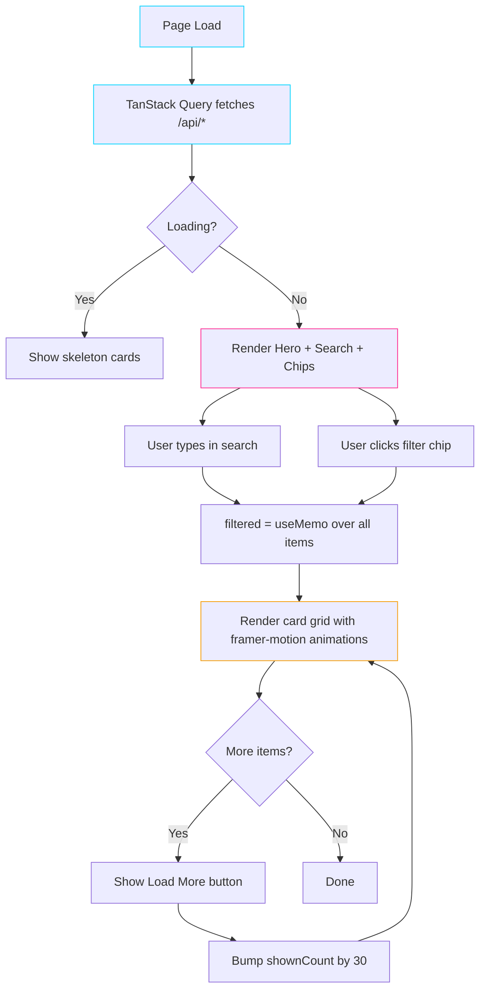
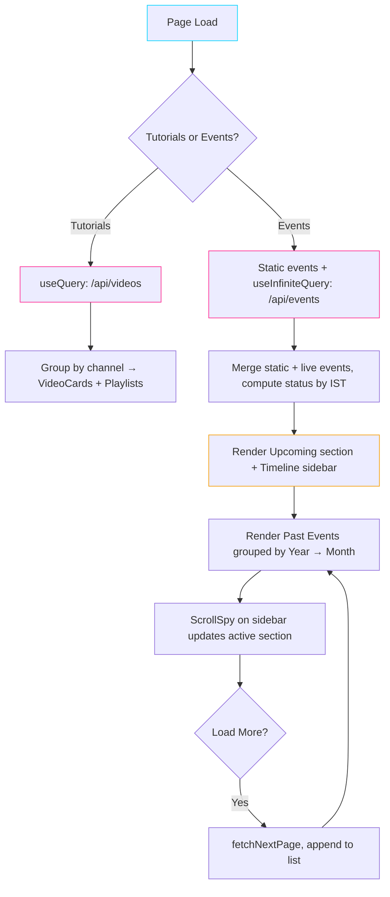
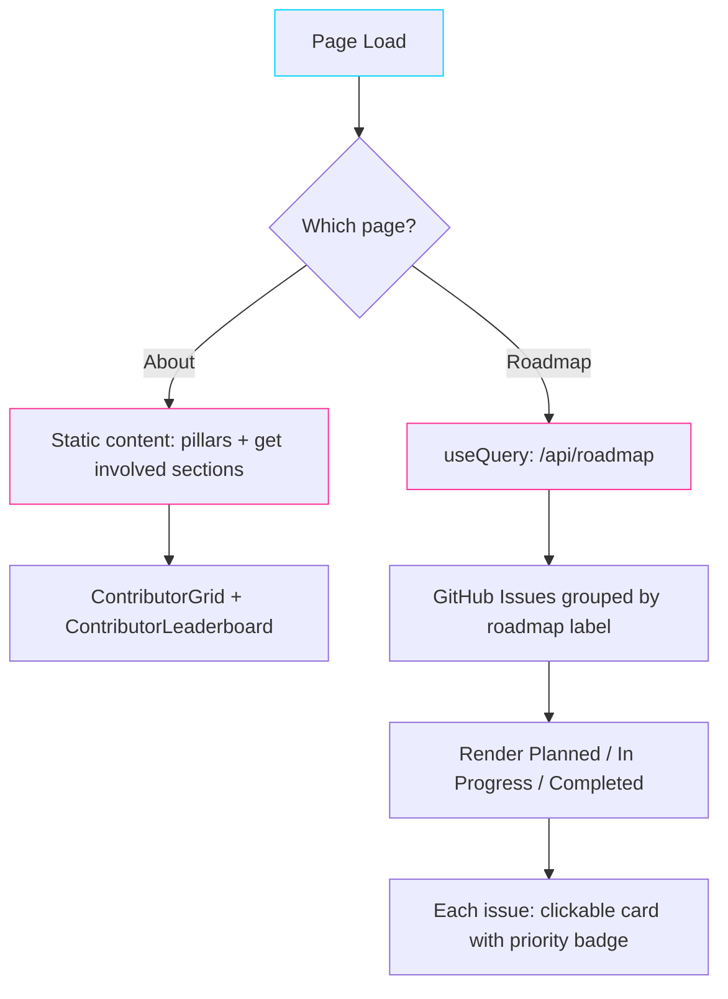
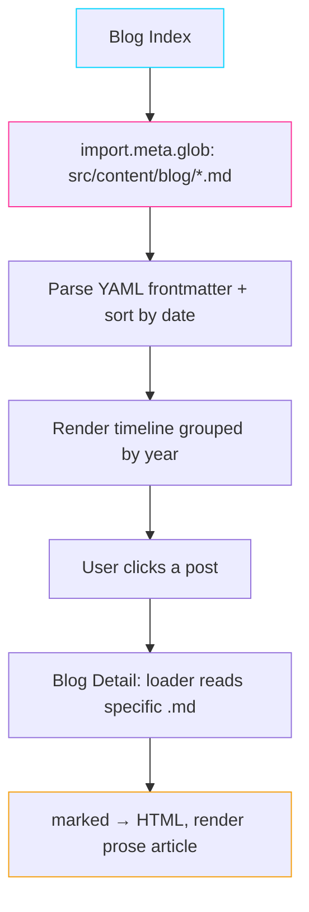
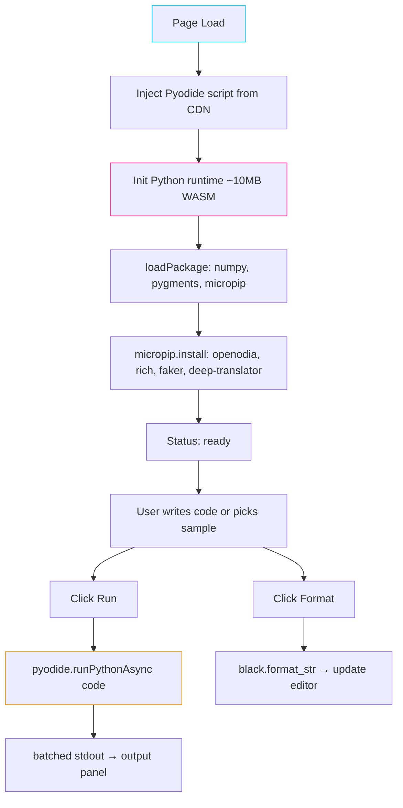
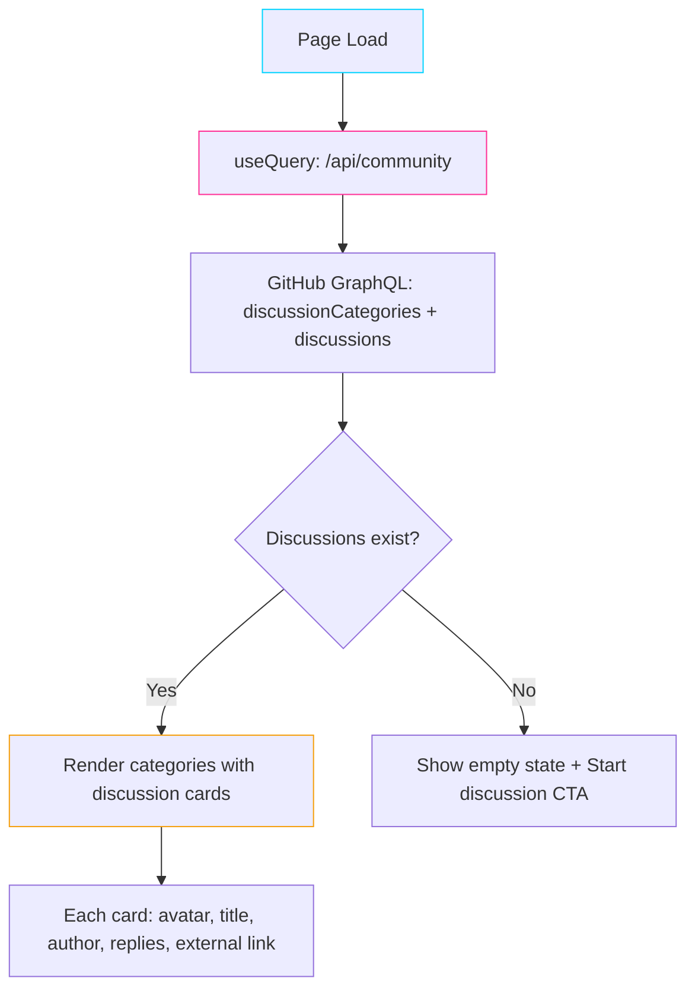

<p align="center">
  
</p>

<h1 align="center">OpenOdia Hub</h1>

<p align="center">
  
  
  
  
  
  
</p>

<p align="center">
  <strong>Open source for the Odia language</strong> — a growing constellation of tools, libraries,<br>
  and resources making Odia a first-class citizen in modern AI and software.
</p>

<p align="center">
  <a href="https://openodia.com">openodia.com</a>
</p>

---

## What is OpenOdia?

OpenOdia is the hub for Odia language open-source. Built and maintained by [Soumendra Kumar Sahoo](https://github.com/soumendrak), it spans three pillars:

- **[@openodia on YouTube](https://www.youtube.com/@openodia)** — tutorials, talks, and demos in Odia & English
- **[OpenOdia · PyPI](https://pypi.org/project/openodia/)** — a Python package of practical tools for Odia language processing
- **[Awesome-Odia-AI](https://github.com/odisha-ml/Awesome-Odia-AI)** — a curated, live directory of 60+ Odia datasets, models, and tools

This repository is the web frontend that brings everything together.

---

## What belongs here

**Everything open source in the Odia language.** No AI gatekeeping. If it's Odia, open source, and useful — it belongs.

| Category | Examples |
|---|---|
| 🎯 **Language tools** | Transliterators, spell checkers, grammar tools, Unicode converters, OCR |
| 🖋 **Fonts & typography** | Open-source Odia fonts, IMEs, keyboard layouts |
| 📚 **Datasets** | Parallel corpora, monolingual texts, speech data, dictionaries |
| 🧠 **Models (open weight)** | STT, TTS, embedding, LLM fine-tunes for Odia |
| 🐍 **Libraries** | Python/JS/Rust packages for Odia text processing, dates, numerals |
| 🎮 **Applications** | Games, apps, utilities built for or in Odia |
| 📖 **Educational** | Language learning tools, interactive tutorials, grammar references |
| 🔧 **Infrastructure** | Odia localization tools, CI/CD for Odia projects, evaluation benchmarks |

---

## Tech Stack

| Layer        | Technology                                            |
| ------------ | ----------------------------------------------------- |
| Framework    | [TanStack Start](https://tanstack.com/start)          |
| Routing      | [TanStack Router](https://tanstack.com/router)        |
| Data         | [TanStack Query](https://tanstack.com/query)          |
| UI           | React 19, Tailwind CSS 4, Radix UI, Framer Motion     |
| Icons        | Lucide React                                          |
| Deployment   | [Cloudflare Workers](https://workers.cloudflare.com/) |
| Package mgr  | [Bun](https://bun.sh)                                 |

---

## Getting started

### Prerequisites

- [Bun](https://bun.sh)
- Node.js 22+

### Install

```bash
git clone https://github.com/soumendrak/openodia-hub.git
cd openodia-hub
bun install
bun run dev
```

The dev server starts at `http://localhost:9090`.

### Available scripts

| Command              | Purpose                  |
| -------------------- | ------------------------ |
| `bun run dev`        | Start Vite dev server    |
| `bun run build`      | Production build         |
| `bun run build:dev`  | Development-mode build   |
| `bun run preview`    | Preview production build |
| `bun run lint`       | Run ESLint               |
| `bun run format`     | Format with Prettier     |
| `bun run test`       | Run Vitest tests         |

---

## How it works

### Card-Browser pages (`/tools`, `/models`, `/datasets`)

These three pages share the same architecture — fetch data from an API, render filterable/searchable card grids with "Load more" pagination.



| Page | Data source | Filter axes |
|---|---|---|
| `/tools` | `/api/awesome` + `/api/repos` | Type (All/Tools/Repos) + Category |
| `/models` | `/api/models` (Hugging Face `filter=or`) | Task type chips |
| `/datasets` | `/api/datasets` (Hugging Face `language:or`) | Task type chips |

### Content List pages (`/tutorials`, `/events`)

Both pages aggregate content from multiple sources with search and filtering, but differ in layout. Events adds a sticky timeline sidebar with scrollspy for year/month navigation.



### Static Content pages (`/about`, `/roadmap`)

Static layout pages with scroll-triggered `Reveal` animations. Roadmap fetches GitHub Issues with `roadmap:*` labels and groups them by status.



### Blog pages (`/blog`, `/blog/$slug`)

Content-driven pages. The index uses `import.meta.glob` to read all `.md` files from `src/content/blog/`, parses YAML frontmatter, and renders a year-grouped timeline. Detail pages render the markdown body via `marked`.



### Playground (`/playground`)

In-browser Python execution via Pyodide WebAssembly. Loads `openodia` + dependencies, runs user code client-side.



### Community page (`/community`)

Fetches GitHub Discussions via GraphQL API, grouped by category with emoji icons.



---

## Data Sources

| Source | What | Cache |
|---|---|---|
| **Hugging Face API** | Odia models & datasets | 1 hour |
| **GitHub REST API** | Repos from 5 Odia orgs | 30 min |
| **GitHub GraphQL** | Discussions | 5 min |
| **GitHub Issues** | Roadmap items | 10 min |
| **GitHub Raw** | Awesome-Odia-AI README | 1 hour |
| **PyPI JSON API** | openodia package info | 1 hour |
| **YouTube RSS** | Video feeds from 4 channels | 1 hour |
| **GDG Bevy (SSR scrape)** | Community events | D1-backed, daily sync |
| **Cloudflare KV** | Contributor data | Synced daily via GitHub Action |

---

## Deployment

```bash
bun run build
npx wrangler deploy
```

CI/CD via GitHub Actions: lint → test → build → deploy on push to `main`.

---

## Contributing

See [CONTRIBUTING.md](CONTRIBUTING.md) for setup, conventions, and where to help.

Quick checklist before opening a PR:

```bash
bun run lint
bun run build
bun run test
```

---

## License

MIT © [Soumendra Kumar Sahoo](https://github.com/soumendrak)
