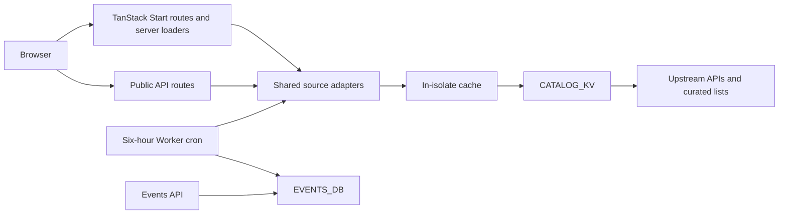

# Architecture and data

Reviewed against the repository on 19 September 2026. Source files and configuration
remain authoritative; catalog counts, availability, and third-party metadata change.

## Request flow

- `src/routes/` defines pages and most API handlers. `src/server.ts` also handles
  contributors, events, the OpenAPI specification, special paths, and scheduled work.
- `src/lib/sources/` contains reusable loaders, parsing, and catalog merging.
- `src/lib/sources/cache.ts` caches values in isolate memory and globally replicated KV.
  Stale values can be served while a refresh runs in the background. A TTL is a cache
  freshness target, not a promise that every upstream record is updated at that interval.
- Directory page loaders fetch on the server. Search/facets run over loaded entries in
  the browser. Treebank search runs on the server and stores its query in the URL.
- `src/lib/facets.ts` shares disjunctive facet counts across directory and paper pages.
- `src/lib/resource-id.ts` defines resource permalinks. `/r/$` renders supported GitHub
  repositories and Hugging Face models/datasets, including available dataset previews.

## Sources and freshness

| Source                                         | Purpose                                                 | Loader freshness / update mechanism                       |
| ---------------------------------------------- | ------------------------------------------------------- | --------------------------------------------------------- |
| GitHub REST                                    | Odia organisation repositories and metadata             | 30 minutes                                                |
| Awesome-Odia-AI README                         | Curated tools and resources                             | 1 hour                                                    |
| Hugging Face                                   | Odia-tagged models and datasets                         | 1 hour                                                    |
| Odia-NLP-Resource-Catalog and indicnlp_catalog | Additional unified-catalog entries and cross-references | 6 hours; pan-Indic entries are filtered for Odia mentions |
| YouTube RSS                                    | Recent uploads from configured channels                 | 1 hour; optional API enrichment for playlists/view counts |
| OpenAlex and arXiv                             | Odia NLP paper discovery                                | 24 hours                                                  |
| UD_Odia-ODTB                                   | Annotated sentences in CoNLL-U format                   | 24 hours                                                  |
| Community event sources                        | Live event records                                      | Worker sync to D1 every 6 hours                           |
| Checked-in event files                         | Curated event history                                   | Reviewed PRs; daily GitHub crawler proposes updates       |
| Contributor sources                            | Contributor grid and leaderboard                        | Daily GitHub sync into CONTRIBUTORS_KV                    |
| PyPI                                           | `openodia` package metadata                             | `/api/pypi` proxy                                         |

Paper task labels come from keyword matching, not author-provided classifications.
Upstream metadata may omit licenses or sizes. A missing preview or temporarily
unavailable feed must not be presented as proof that a resource/channel has no content.

## Public APIs

The interactive reference is at `/api`; the machine-readable contract is
`/.well-known/openapi.json`, generated in `src/server.ts`.

| Endpoint            | Purpose                                                             |
| ------------------- | ------------------------------------------------------------------- |
| `/api/resources`    | Merged catalog; `kind`, `license`, `author`, `q`, `limit`, `offset` |
| `/api/awesome`      | Parsed Awesome-Odia-AI entries                                      |
| `/api/repos`        | Repository catalog                                                  |
| `/api/models`       | Odia-tagged model catalog                                           |
| `/api/datasets`     | Odia-tagged dataset catalog                                         |
| `/api/videos`       | Community channel videos and available playlists                    |
| `/api/events`       | Paginated community events                                          |
| `/api/contributors` | Contributor data                                                    |
| `/api/pypi`         | Python package metadata                                             |

`/api/resources` defaults to 50 entries and caps a requested limit at 200.
See the OpenAPI reference for current response shapes and other query parameters.
`/events-feed`, `/llms.txt`, `/llms-full.txt`, and `/sitemap.xml` provide additional
syndication and discovery surfaces.

## Playground and language support

- Python examples use Pyodide and `openodia`; the runtime and dependencies download
  on first use. `black` installs when formatting is requested; `indic-nlp-library`
  installs when the Indic examples or Transliteration need it.
- Odialang uses `@devsuvam/odialang` to compile to JavaScript and execute in the browser.
- Transliteration maps Odia into other Indic scripts. Optional letter folding improves
  compatibility at a cost to spelling fidelity. This is not language translation.
- Local execution does not imply every Python library works without networking;
  network-dependent calls can fail because of CORS or upstream availability.
- Community model inference is displayed as planned, not an implemented engine.
- The locale toggle currently covers navigation strings. Theme and locale are persisted
  in local storage; this is not full translation of catalog content or page bodies.

## Deployment and configuration

- `bun run dev` serves port **9090**. `bun run build` builds the Worker application;
  `npx wrangler deploy` deploys using `wrangler.jsonc` and Cloudflare credentials.
- The checked-in bindings point to the project's Cloudflare resources. A fork must
  configure its own domains, KV namespaces, and D1 database before deployment.
- `CONTRIBUTORS_KV` stores contributor snapshots; `CATALOG_KV` stores shared cached
  source data; `EVENTS_DB` stores synced events. D1 schema lives in `db/schema.sql`.
- Some development bindings have `remote: true`; local development can read remote
  services. Do not assume every development data source is isolated.
- The Worker cron is `0 */6 * * *`. It refreshes event data and warms catalog sources.
- `GITHUB_TOKEN` is optional upstream GitHub authentication; `YOUTUBE_API_KEY` enables
  optional YouTube enrichment. Never commit credentials. Consult the relevant loader
  and your runtime's environment setup when configuring them.
- `.github/workflows/ci.yml` runs lint, changed-line coverage, and build in parallel.
  Production deploys on `main` after all checks pass. Same-repository PR previews use
  Worker version uploads; their KV is shared with production.
- Separate GitHub workflows sync contributors, propose event-data PRs, and check links.

## Documentation maintenance

When a page, source, engine, or workflow changes, update the README feature table,
this document, and CONTRIBUTING as appropriate. Treat `plan.md`, `issues/`, and old
verification totals as historical project records unless explicitly remeasured.
For demonstrations, rehearse the deployed site: code inspection does not establish
that every upstream dependency is available during recording.
